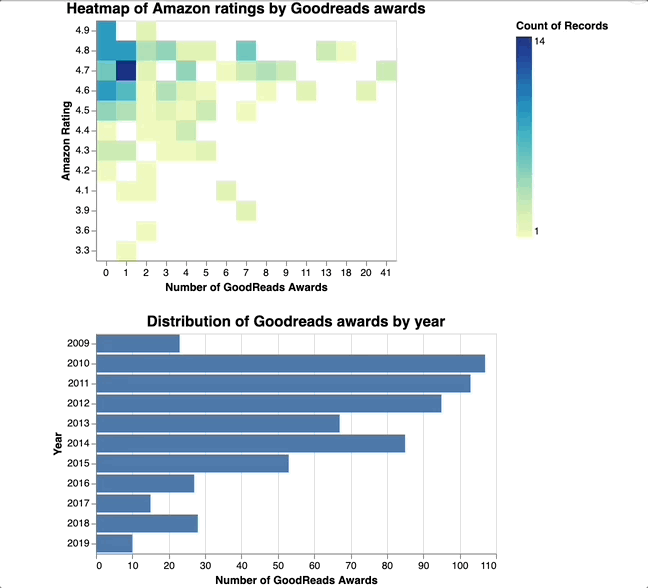
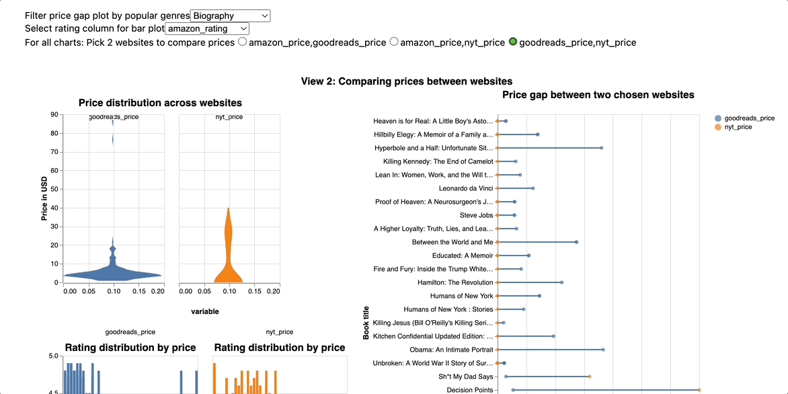
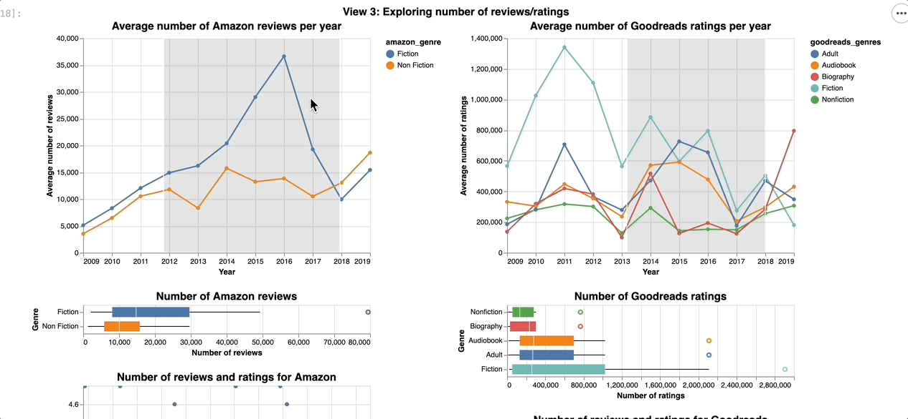

# Data Visualization Project
## Exploring Bestseller Books on Amazon and GoodReads
### Completed April 2023 with Isabela Lucas Bruxellas, Erika Delorme, Kaylie Nguyen
#### For full project report, see [Best Books Visualization Notebook](https://github.com/lanchiphamm/Books_Visualization/blob/master/Milestone_2_Final.ipynb).
#### Introduction
Our data science project aims to explore and analyze the attributes of bestseller books and 
identify any relationships between them. The project consists of 3 interactive views focused on answering 
the following tasks:   
#### VIEW 1
**Task 1**: Is there a correlation between the number of Goodreads Awards and the rating of books on Amazon?       
**Task 2**: Compare the number of Goodreads Awards across the years (distribution of awards). 

  

#### VIEW 2
**Task 3**: Compare the distribution of book ratings across prices for different websites.   
**Task 4**: Compare book prices across different sites (distribution of prices).     
**Task 5**: Compare the difference in distribution of book prices across different websites.  

  

#### VIEW 3
**Task 6**: Compare the relationship between the number of reviews and rating of bestseller books for Amazon and Goodreads.     
**Task 7**: Describe how the average number of reviews/ratings for the Amazon genres and the top 5 Goodreads genres changes over time.    
**Task 8**: Explain how the distribution of review/rating counts compare for each genre of Amazon and Goodread books.   

  

#### Language: Python with Vega-Altair for Visualization
